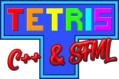

# Tetris - C++ & SFML v1.1


## Introduction

That's the !(first) version of this game (23/08/2020) and my first videogame project! \
All designs are own, but free to use.

I'm not gonna lie to you: the game have some bugs yet. If you find any, please send me a message or send me a pull request in the [GitHub repository](https://github.com/Adrian-2105/Tetris-Cpp_SFML).

One last thing: I encourage you to find the easter egg there is ;) \
(It is not worth looking at the game files to find out :B)

## Requirements

The only thing you need to be able to execute it is:

- A Linux environment (it has only been tested on Ubuntu)
- Have the SFML library installed

If you don't have SFML installed, you can use the attached script `sfml_installer.sh` to install it, or use the next commands (valid on Ubuntu):
```
sudo apt-get update
sudo apt-get install libsfml-dev
```
If you use another version of linux and the above has not worked for you, here is the [official SFML installation page on Linux](https://www.sfml-dev.org/tutorials/2.5/start-linux.php).

If you want to recompile it, you must have the following packages installed:

```
sudo apt-get build-essential make cmake
```

## How to compile it

In this repository there is already an executable called `Tetris-C++_SFML` with the project code compiled and ready to run. In the event that this executable does not work for you, or you want to try to make modifications to the code and recompile it, you must execute the next commands from the project directory:

```
cmake CMakeLists.txt
make
```

## Controls

- ENTER: advance (only in menus)
- ESC: exit the game (only in main menu) / pause the game
- LEFT, RIGHT, DOWN: move the piece in the specified direction
- UP: rotate the piece

## Updates

### v1.1

Small update that corrects the main problems of the game, but does not add anything new.

  - A maximum limit of 24 FPS has been set
  - Difficulty scale has been improved
  - The scoring system has been improved
  - Fixed a bug that caused a termination error, which did not affect the gameplay
